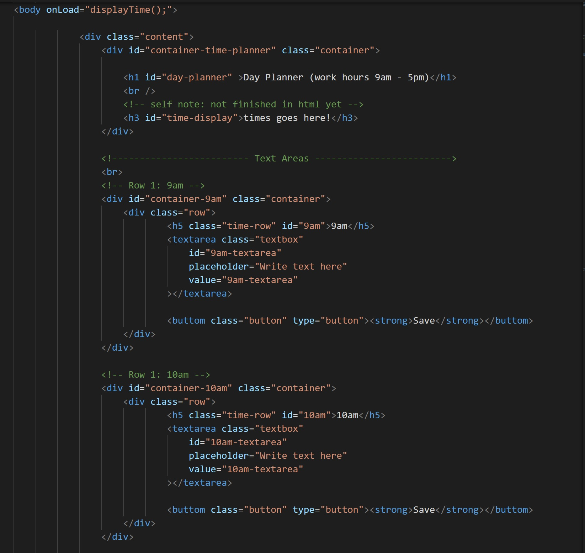
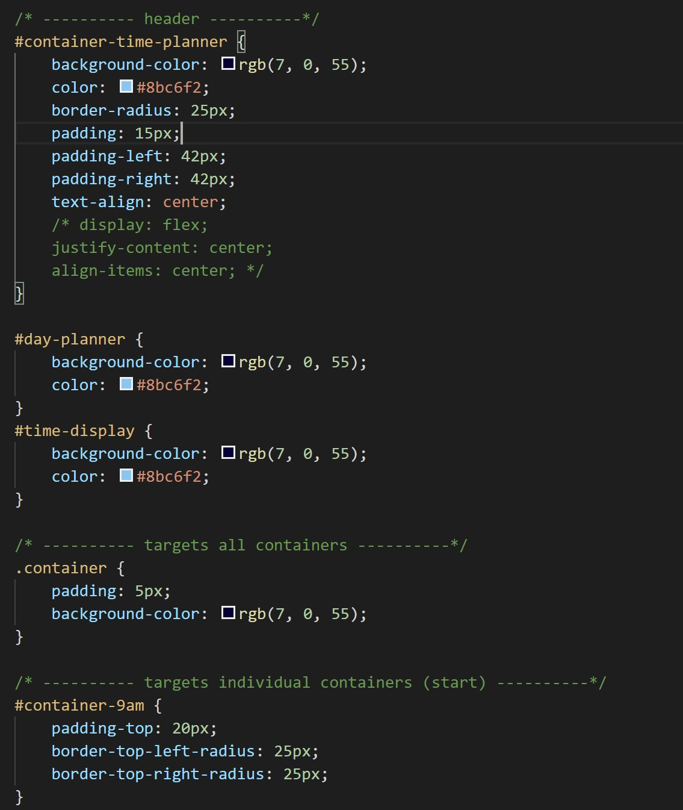
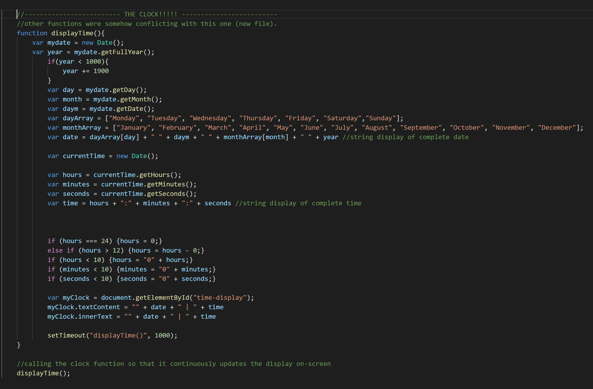
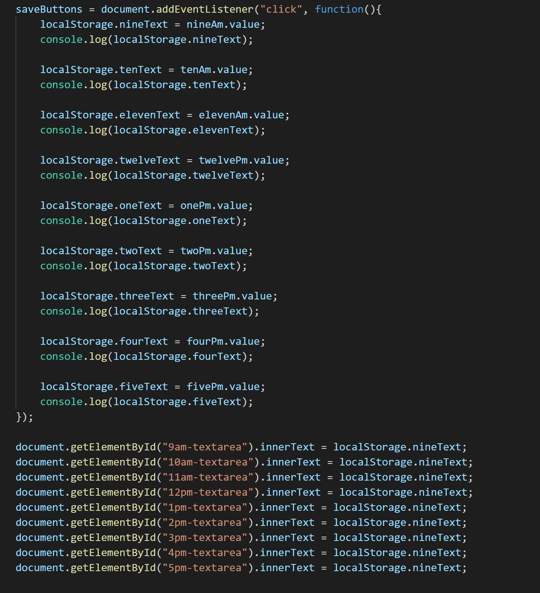
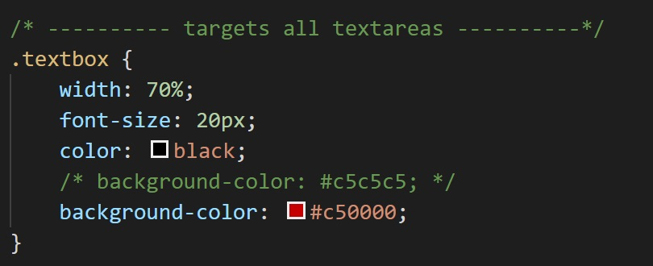
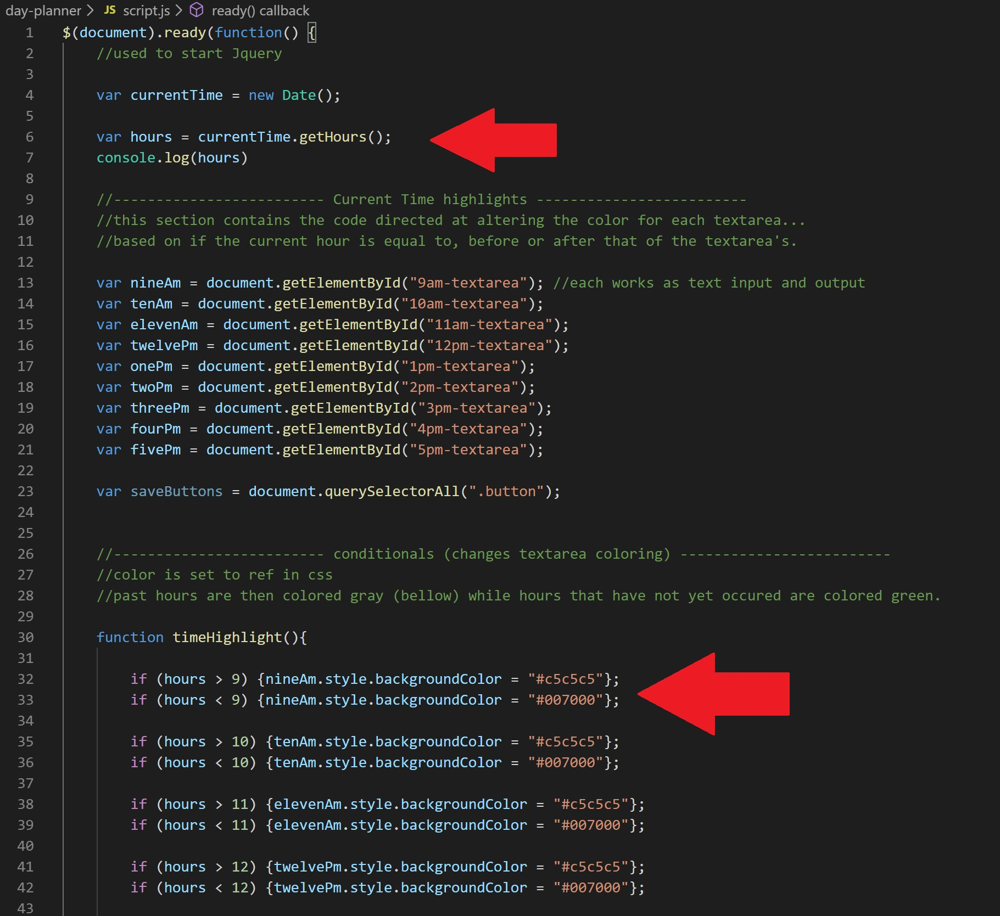
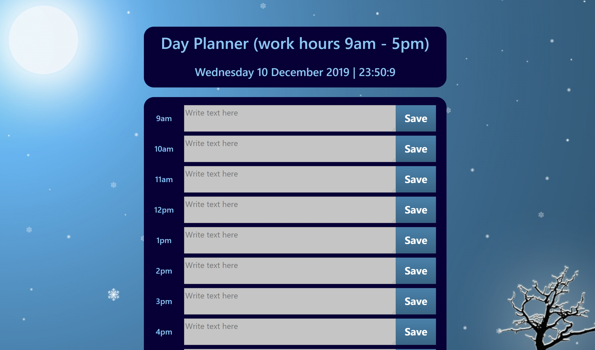

# Project Title: Day Planner
​
This project was to create a functional day planner specifically targetting work hours (9am - 5pm) integrating with current time/date information to make the planner more interactive. The idea is that the user can see past, current and future sechuled plans that they have writen in and saved for themselves (to local storage).

# How it Works:

This day planner tracks a typical work day between the hours of 9am to 5pm. The user may write and save content within each text area per hour. The current hour will be highlighted in red. Hours that have passed are in grey and hours yet to come are highlighted in green.
​
## Getting Started
​
As with all projects, i began with creating, in git bash, the needed files which included an index.html, a stlye.css and a script.js. I began working in the index.html, writing out from scratch all the skelenton basics of the day planner such as the containers, textareas, buttons and displays (time/date and header). I was sure to assign classes to each button and textarea, along with unique IDs for each to identify and seperate each one from the others (using the target hour as a means to organize. Example: id="9am-textarea", id="10am-textarea; see image...).

As you can see in the image above, i had to copy and paste quite a bit, basically replicating the same code for every row which contained the hour, a textarea and save button (as previously mentioned). Though the code doesn't look very appealing or organized, i assure you that i was very precise and exact with how i wanted to oraganize the values, classes and ids.

The classes were mostly to be used for when i created the css where-as the values would be for placing text back into the textareas (after being saved) and the IDs would be used for adding elements by IDs to create event listeners in coordination with the save buttons. I may be failing to explain this with proper terminology...that and i am slightly sleep deprived but i assure you that everything was mostly mapped out before i began even writing a single line of code. The way of the psudo code is strong with me. Of course, i definitely altered things over time but having that starting framework certainly made the entire process a lot easier.

Here are some images of how i related the classes to css along with the values and IDs...

In this image specifically, you can see where IDs and classes were used in my css creating, specifically at the bottom section of the image where container and container-9am are located. Oddly enough, i really only needed the IDs for container-9am and container-5pm to mostly manipulate the border radius.

#container-9am {
    padding-top: 20px;
    border-top-left-radius: 25px;
    border-top-right-radius: 25px;
}
#container-5pm {
    padding-bottom: 20px;
    border-bottom-left-radius: 25px;
    border-bottom-right-radius: 25px;
}
​
Throughout this project, i found that i really enjoy working with css which is not an opinion i had when first diving into it. But now i see it almost like a clerifying process, helping me to organize my thoughts and approach before moving onto script.js...which brings me to my next section...THE CLOCK!!!!

This part was a little challenging to make but google made for an excellent assistant. The hardest part for me was actually understanding what 'new Date()' actually was. From there, it got easier to do the rest. As you'll see in my code, i ended up making a new .js file called clock.js. This was not just for the sake of organizing my code (which i have become quite obssessive over doing) but also to avoid other functions from interfereing with it. This sort of conflict actually happened once the clock was completed and i started moving onto other features of the page. I probably could have found a better solution but keeping organized and also preventing conflicts between functions both being fixed by such a simple concept as creating a new .js file just seemed too good a fix to ignore. Also time has not been my friend in these projects and i needed every bit i could spare. Displaying the clock wasn't too difficult either as i smply placed it within the header section along with the day-planner container.

...also, yes, i just took those pictures tonight, the night the project is due. usually ill write the README.md as i go but this time around i decided to dedicate my focus on one little project at a time, leaving the walk-through of said project for the end.

the next issue i encountered was with storing the information writen in each textarea to localStorage. This was quite a challenge because, even at this point, i am still somewhat unfamiliar with the inner workings of localStorge. tis, or rather twas*, an enigma i only mannaged to actually understand today as i forced my way through it. I'm still quite unclear on how to store individual things within individual textareas (as you'll find when testing my day planner out) but i'll figure it all out eventually. Still learning and some things take longer than others. I'm definitely on the right track but i ran out of time before i could complete it. Will definitely re-visit this part after the project is graded as i'd like to complete it, even if not on time for the best grade.

Here is an image of what i have currently for storing and displaying within the textarea...

Another part of the project worth mentioning is the feature to change color of each textarea to match the current time...
current hour: textarea is red
hours past: textarea is gray
hours yet to come: textarea is green

I'm aware that many of my fellow classmates struggled with this part but, surprisingly, i found it to be very easy. I simply set the textarea default background-color to a red that i preferred, created a mini-clock (tracking just the current hour) on the script.js file and then wrote conditional if statements to alter the textarea with .style to a preferred gray (current hour > the textarea's designated time (example: 9am) and another for less than "<"). I'll include images for this as well...

The red Arrows just point to the clock and where the variable of hours fits in with the conditionals.

And that's about it. i found this project to be somewhat straightforward but very time-consuming. Here's hoping all projects follow that pattern for me as i quite enjoyed working on this. May actually continue to build on it in the future. I much prefer my own design over my current day-planner (the calendar on my phone....its kinda boring and a little ugly. they could have done better with the design). May even include something to track the seasons and change the color and background display in the future. that would be really cool.

final result image above....its a little cut off but should look like that more-or-less.

## Built With
​
* [HTML](https://developer.mozilla.org/en-US/docs/Web/HTML)
* [CSS](https://developer.mozilla.org/en-US/docs/Web/CSS)
* [Javascript](https://developer.mozilla.org/en-US/docs/Web/JavaScript)
​
## Deployed Link
​
* [See Live Site](https://casey-moldavon.github.io/day-planner/)
​
​
## Authors
​
* **Casey Moldavon** 
​
- [Link to Portfolio Site](https://casey-moldavon.github.io/day-planner/)
- [Link to Github](https://github.com/casey-moldavon/day-planner)
- [Link to LinkedIn](https://www.linkedin.com/in/casey-moldavon-442a1761/)
​
See also the list of [contributors](https://github.com/your/project/contributors) who participated in this project.
​
## License
​
This project is licensed under the MIT License 
​
## Acknowledgments
​
* definitely a big thankyou to the instructor and TAs, all of which were a big help. Thank you Kerwin for helping me with the local Storage. Though it still doesn't work perfectly, its a lot better than what it was before.
Thank you to the classmates in my study group as well.